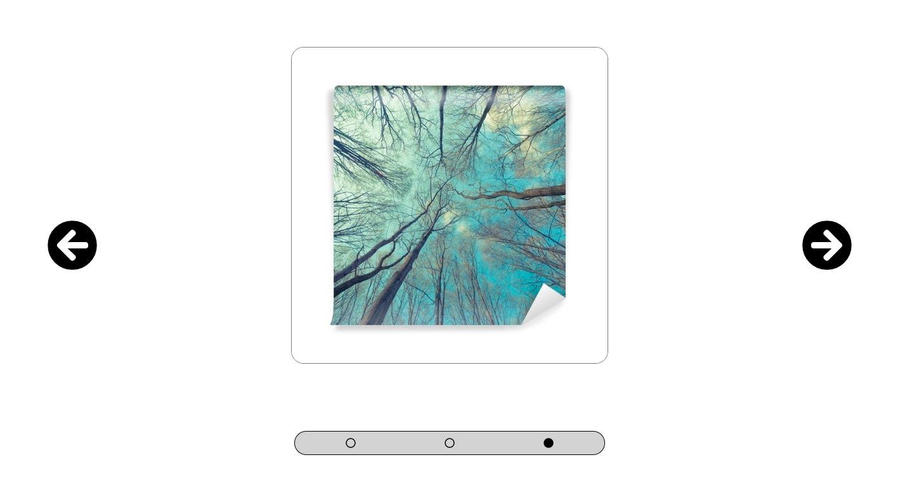
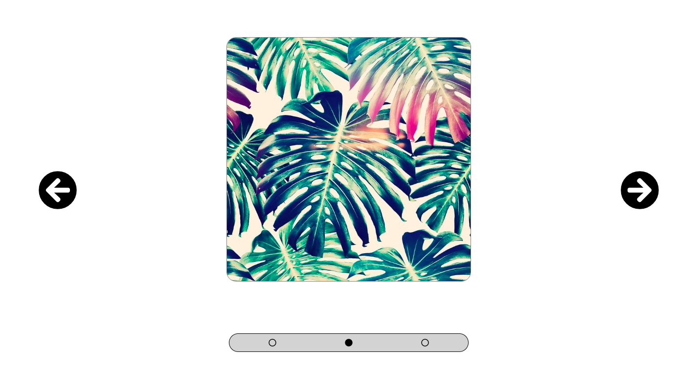

# htmlcssjs-slider
<h1> A simple Slider </h1>
<h2>Goal:</h2>
Build a simple layout slider using <b>Javascript/Jquery</b>

<h2>Usage</h2>

The user can slide trough images clicking <b>onto the lateral arrows<b> or <b>on the dots</b> below the images 

</h>

</h>

</h>

